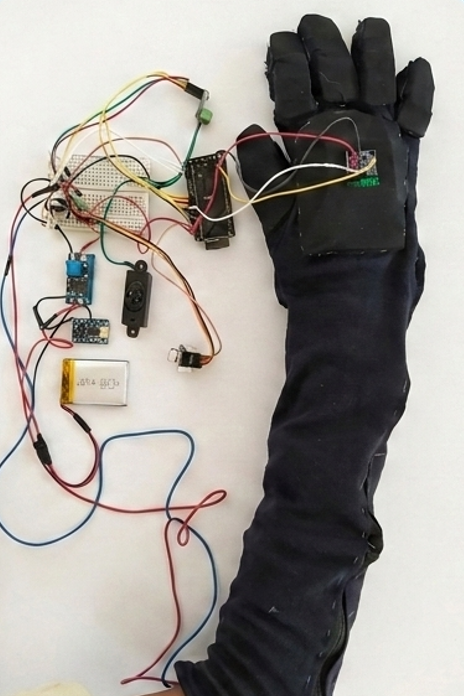
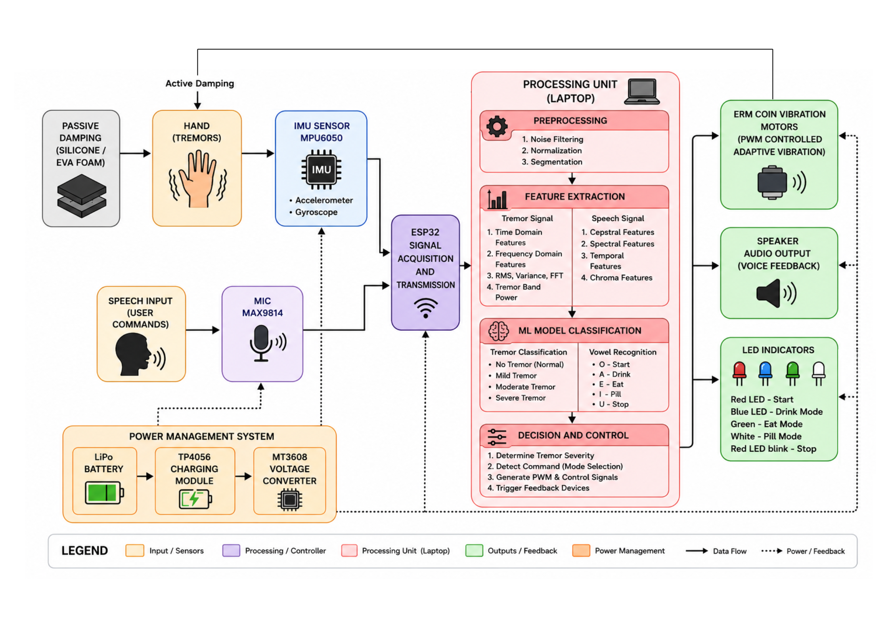

# 🧤 TremorSense: Adaptive AI Glove for Parkinson's Tremor Suppression

> **🚧 Status:** Active Development 
> **🏆 Recognition:** Selected for Oral Presentation at ICMMB (October 7, 2026, Singapore)

TremorSense is a low-cost (< ₹22,000 INR), multi-modal wearable assistive system designed to suppress pathological hand tremors in Parkinson's disease. By fusing real-time IMU kinematic tracking with speech-guided intent recognition, the system provides task-adaptive vibrotactile therapy tailored to specific Activities of Daily Living (ADLs) such as drinking, eating, and medication handling.

## 🎥 System Demonstration & Hardware

**Watch the system in action:**
[▶️ Click here to watch the TremorSense Demonstration Video](TremorSense_Glove_Demo.mp4)

## ✨ Key Innovations
*   **Dual-AI Pipeline:** Fuses a 135-feature acoustic Random Forest classifier (99.8% CV accuracy) for vowel-based speech commands with a 53-feature IMU Random Forest classifier (90% test accuracy) for tremor detection.
*   **Task-Aware Suppression:** The first wearable to dynamically adjust suppression intensity based on the patient's spoken intent.
*   **Hybrid Damping Architecture:** Combines passive, zero-power silicone and EVA foam finger damping with active, PWM-modulated Eccentric Rotating Mass (ERM) motors on the forearm.
*   **Multi-Modal Feedback:** Utilizes color-coded RGB LEDs and I2S-driven voice audio confirmation for accessible mode acknowledgment without caregiver dependence.

## 🗣️ Speech-Guided Command Mapping
The system uses an embedded microphone (MAX9814) to recognize specific vowel sounds, allowing hands-free task selection.

| Vowel Command | LED Indicator | System Mode | Actuation Intensity |
| :--- | :--- | :--- | :--- |
| **O** | 🔴 Solid Red | System Awake | Idle (0 PWM) |
| **A** | 🔵 Solid Blue | Drink Mode | High (Prevents liquid spillage) |
| **E** | 🟢 Solid Green | Eat Mode | Moderate (Preserves voluntary motion) |
| **I** | ⚪ Solid White | Pill Mode | Low (Preserves fine pinch grip) |
| **U** | 🚨 Blinking Red | System Stopped | Motors Halted |

## 📊 System Architecture
The architecture is partitioned into two layers: a dedicated real-time ESP32 sensing/actuation node and a Python-based laptop inference backend, communicating via UDP.

1.  **Lane 1 (Kinematics):** The MPU-6050 streams data to the Python backend, which isolates the 3-8 Hz Parkinsonian tremor band and classifies tremor severity.
2.  **Lane 2 (Acoustics):** The MAX9814 captures vowel commands (A=Drink, E=Eat, I=Pill, O=Wake, U=Stop), triggering mode-specific PWM profiles.
3.  **Lane 3 (Actuation):** The backend transmits computed, smoothed PWM signals back to the ESP32 to drive the ERM array, complemented by LED and voice feedback.

## 🛠️ Hardware Stack
*   **Microcontroller:** ESP32-S3-WROOM-1 (Dual-core, WiFi enabled)
*   **Sensing:** MPU-6050 6-axis IMU (100Hz sampling) & MAX9814 Analog Microphone with AGC
*   **Actuation:** 8x C1026B002F ERM Coin Vibration Motors
*   **Audio/Visual:** MAX98357A I2S Amplifier & Common-Anode RGB LED
*   **Power:** 3.7V LiPo with TP4056 charging & MT3608 boost converter

## 👥 Research & Development
Developed by Hareesh Karthikeyan G, Nitiswaar S, and Shanmuga Priya J under the guidance of Dr. G. Kavitha at the Department of Biomedical Engineering, College of Engineering Guindy, Anna University. Sponsored by the Centre for Sponsored Research and Consultancy (CSRC).
